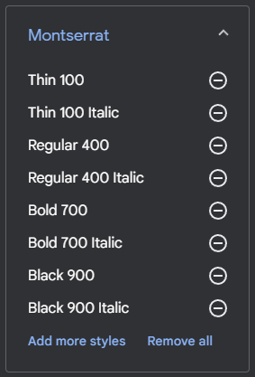

# PaginaPersonal

- [ ] Estudiar la opcion de añadir efecto parallax en el header del index

- [ ] Revisar como iba el tema del preload y la siguiente pagina a cargar

- [x] Revisar proyecto en AdobeXd para poder orientarte

- [x] Estudiar hacer el nav sticky junto a un falso negro para que se quede ahí pillado (Jugar con los z-index)

- [x] Hacer un degradado negro con photoshop en el hero

- [x] Estudiar algun texto bonito para el hero

- [ ] Estudiar efecto type con libreria externa

- [ ] Botton de autoscroll

- [ ] Logotipo de Emmet y añadirlo a la lista

- [ ] Ordenar logos y meterlos en carpetas

Investigacion sobre el codigo de los SVGs y como modificarlo bajo las etiquetas de `<defs></defs>` en este caso añadiendole la clase cls-1 bajo la misma sintaxis que html