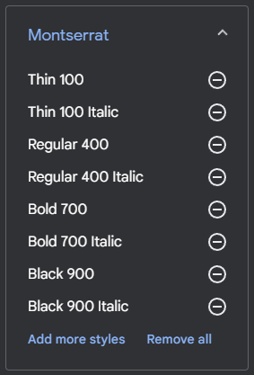

# PaginaPersonal

Fuente utilizado montserrat

[ ] Estudiar la opcion de añadir efecto parallax en el header del index

[ ] Revisar como iba el tema del preload y la siguiente pagina a cargar

[ ] Revisar proyecto en AdobeXd para poder orientarte

[ ] Estudiar hacer el nav sticky junto a un falso negro para que se quede ahí pillado (Jugar con los z-index)

[ ] Hacer un degradado negro con photoshop en el hero

[ ] Estudiar algun texto bonito para el hero + posible efecto type con libreria

[ ] Botton de autoscroll

[ ] Logotipo de Emmet y añadirlo a la lista

Investigacion sobre el codigo de los SVGs y como modificarlo bajo las etiquetas de `<defs></defs>` en este caso añadiendole la clase cls-1 bajo la misma sintaxis que html