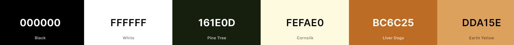
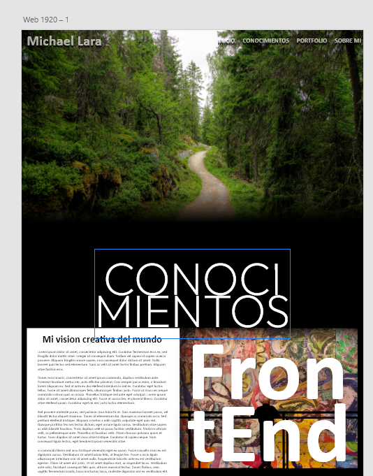

# Pagina personal

## Indice
* Sobre este proyecto
    * Instalacion y despliegue
    * Tecnologias usadas
    * Origen
    * Objetivo
* Recursos
    * Fuentes utilizadas
    * Paleta de colores
    * Concepto e inspiracion
* Retos presentados
    * Nav se mantiene sticky fuera de su padre
    * Dominio sobre archivos SVG
    * Uso y masterizacion de clamp() y min() en CSS
    * Practica Emmet
    * Sistema de tarjetas de la pagina knowledge
    * Optimizacion
        * Implementacion de preloads y prefetchs
        * Optimizacion de GoogleFonts
    <!-- * Reto de WatchFriendly -->
    <!-- * Boton de autoscroll (Primer contacto con JavaScript en el DOM) -->
<!-- * Agradecimientos -->
<!-- * Autor -->
    
---

## Sobre el proyecto

### Instalacion y despliegue:
Para ver el proyecto simplemente tienes que entrar en [esta pagina](https://mrsetone.github.io/PaginaPersonal/) o ejecutar en la terminal `git clone https://github.com/MrSetOne/TB_09_JavaScriptMid.git` y ejecutar el archivo index.html.

### Tecnologias usadas:
Para este proyecto he usado HTML, CSS y JavaScript sin frameworks

### Origen:
Este es mi trabajo de final de rampup del bootcamp de Full Stack Developer en The Bridge.

### Objetivo:
Consiste en la maquetacion y desarrollo de mi pagina web personal, como si fuese una especie de "curriculum online" 

---

## Recursos
### Fuentes utilizadas:
Para esta pagina he utilizado fuentes de GoogleFonts, para ser mas exactos he usado la fuente Montserrat y Beau Rivage.

### Paleta de colores:
La paleta de colores ha sido diseñada en al pagina de Coolors y la pagina esta diseñada principalmente con colores en clave baja (Colores oscuros), la paleta de color utilizada es la siguiente:



### Concepto e inspiracion:
La idea es generar una mezcla entre diseño industrial con colores oscuros y naturaleza con tonos verdes.

Este protecto está basado en la metodología BEM y Tiny tweaks para conseguir un buen responsive. 

La el diseño principal está basado en un diseño que tenia hace tiempo realizada en AdobeXd:



---

## Retos presentados

### Nav se mantiene sticky fuera de su padre:
En este proyecto queria hacer que en el index hubiese un hero que ocupase el 100% de la pantalla pero que el nav quedara por encima del hero y se mantuviese así, para esto tenia pensado usar position: sticky, el problemas es que se quedaba dentro del contenedor, para conseguir que se quedase fuera la solucion ha sido usar `position: fixed` y debajo del hero he colacodo una embellecedo que hace de fondo real del nav en el resto de la navegacion dentro de index.html, para esto he tenido que asignarle unos z-index altos tanto al nav como a su fondo.

### Dominio sobre los SVG
Para el uso de iconos he usado la libreria de FontAwesome, lo que ocurre es que para la pagina knowledge.html queria meter muchos logos los cual no estaban en dicha libreria, entonces he tenido que buscar los archivos SVG de distintos bancos de imagen, el problema está en que la mayoria de estos archivos llevan dentro los colores ya asignados, tras bastantes pruebas y experimentos he descubierto que los archivo SVG cuentan con las etiquetas `<style>` y `<defs>`, estas etiquetas sirven para otorgar al archivo de propiedades de estilos. El archivo tiene diversas capas, en todos los que he tocado se llamabas `cls-X`, simplemente ha que cambiar la propiedad `fill:#xxxxxx` por el color en hexadecimal que quieras colocar.

Ejemplo de estructura tipica queencuentras dentro de estos archivos `<defs><style>.cls-1{fill:#xxxxxx}</style></defs>`

### Uso y masterizacion de clamp() y min() en CSS
En este proyecto he utilizado las funciones `clamp()` y `min()` para poder hacer responsive la pagina sin abusar de MediaQueries, el funcionamiento de estas funciones es la siguiente:
* `min()` => Para que funcione correctamente tienes que usar un valor absoluto y otro relativo, siempre usa el tamaño mas pequeño de los dos, se usa principalmente para la propiedad `width:`.
* `clamp()` => Para esta funcion es necesario 3 valores, dos absolutos y uno relativo, los absolutos valen como topes (minimo y maximo) y el relativo como valor ideal, el cual cambia de tamaño hasta alcanzar uno de los dos topes, se usa principalmente en la propiedad `font-size:`.

### Practica con Emmet
En esta página tiene una gran cantidad de lineas HTML y usa la metodologia BEM, lo que hace que se le dedique mucho tiempo a HTML, para intentar agilizar esto he "abusado" lo maximo posible de Emmet, adjunto ejemplo de como esta herramienta optimiza tanto:

Codigo introducido en Visual Studio code:

`h1.portfolio__container+div.porfolio__container>div.portfolio__item*4>img.portfolio__imagen+div.portfolio__description>h2.description__title+p.description__text+a>img`

Lo que devuelve Emmet:

```html
<h1>Portfolio</h1>
<div class="porfolio__container">
    <div class="portfolio__item">
        
        <div class="portfolio__description">
            <h2 class="description__title"></h2>
            <p class="description__text"></p>
            <a href=""></a>
        </div>
    </div>
    <div class="portfolio__item">
        
        <div class="portfolio__description">
            <h2 class="description__title"></h2>
            <p class="description__text"></p>
            <a href=""></a>
        </div>
    </div>
    <div class="portfolio__item">
        
        <div class="portfolio__description">
            <h2 class="description__title"></h2>
            <p class="description__text"></p>
            <a href=""></a>
        </div>
    </div>
    <div class="portfolio__item">
        
        <div class="portfolio__description">
            <h2 class="description__title"></h2>
            <p class="description__text"></p>
            <a href=""></a>
        </div>
    </div>
</div>
```

### Sistema de tarjetas de la pagina knowledge

Otro de los beneficios de la metodologia BEM es la capacidad de otorgar modificaciones a algunos elementos solo usando clases, por ejemplo el sistema de tarjetas de knowledge.html, aqui he generado las clases:
* `.knowledge__item` => Conocimientos adquiridos no masterizados
* `.knowledge__item--inprogress` => Conocimientos en camino de ser aprendidos
* `.knowledge__item--dominated` => Conocimientos adquiridos y masterizados 

De esta forma logramos poder incorporar mas items a la lista sin ser necesario volverse loco tocando estilos, ya que solo es necesario asignarle las clases correctas.

### Optimizacion

Cara a la presentacion del proyecto veo que los tiempos de cargas son "lentos" a la hora de cargar la version Web, para ello decidí implementar las siguientes mejoras.

#### Prefetch y preload

Usé preload para evitar que cargase la pagina HTML antes que la hoja de estilos o la imagen del hero, ya que esto provocaba una sensacion de inestabilidad en al pagina, tambien usé la propiedad prefetch en la siguiente pagina en la que se espera que entre el usuario, de esta forma se va descargando la pagina antes de que el usuario llegue a entrar en el enlace

#### Optimizacion de GoogleFonts
A pesar del prefecth y preload observo que las fuentes provenientes de GoogleFonts tardan en cargar y seguia teniendo ese efecto de inestabilidad, revisando los tiempos de descargas veo que la descargas de dichas fuentes eran demasiado elevados, llegando a los 150ms, al parecer tenia muchos estilos de fuentes que no estaba usando, pero igualmente se descargaban, la solucion fue modificar el `@import` para que cargasen solo las fuentes necesarias, así consigo optimizar el tiempo de carga para que solo tarde 30ms.


- [x] Revisar proyecto en AdobeXd para poder orientarte

- [x] Estudiar hacer el nav sticky junto a un falso negro para que se quede ahí pillado (Jugar con los z-index)

- [x] Estudiar algun texto bonito para el hero

- [x] Logotipo de Emmet y añadirlo a la lista

- [X] Ordenar logos y meterlos en carpetas

- [x] Mejorar el nav usando grid

- [x] Añadir margin al footer

- [x] Upgrade de las tarjetas de conocimientos 

- [x] Revisar como iba el tema del preload y la siguiente pagina a cargar

- [x] Actualizar importacion de google fonts y limpiar head

- [x] Optimizacion de imagenes pesadas

- [x] Revisar y limpiar "Spanglish"

- [x] Mejorar el responsive para whatch con MQ combinadas

- [x] Botton de autoscroll

- [ ] Añadir hovers compuestos

- [ ] Generar variables y clases de utilidades para limpiar codigo

- [ ] Comprimir el css y generar su version "lite"

- [ ] Estudiar la opcion de añadir efecto parallax en el header del index

- [ ] Estudiar efecto type con libreria externa

- [ ] Hacer una página de fotografía y estudiar donde llevan las tarjetas de hobbies

Investigacion sobre el codigo de los SVGs y como modificarlo bajo las etiquetas de `<defs><style>.cls-1{fill:#xxxxxx}</style></defs>` en este caso añadiendole la clase cls-1 bajo la misma sintaxis que html

Micropractica con emmet, he usado el codigo:

`h1.portfolio__container+div.porfolio__container>div.portfolio__item*4>img.portfolio__imagen+div.portfolio__description>h2.description__title+p.description__text+a>img`

para obtener el siguiente codigo:

